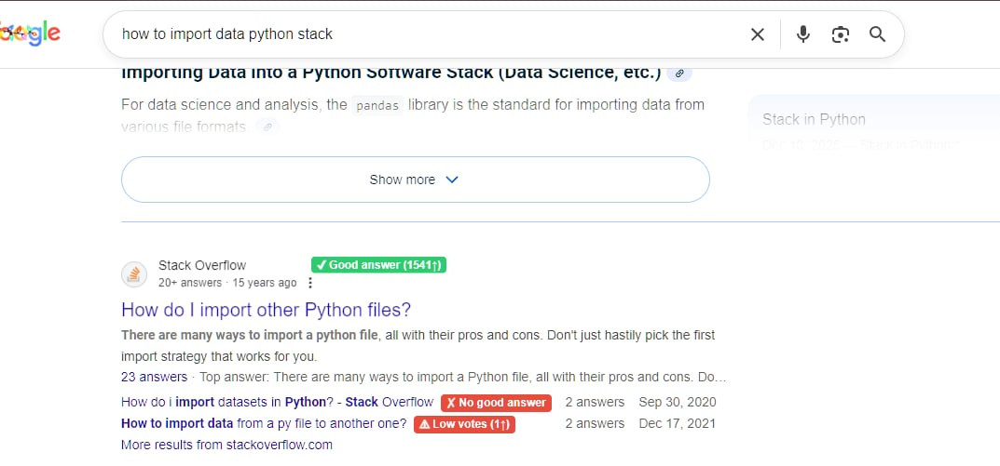
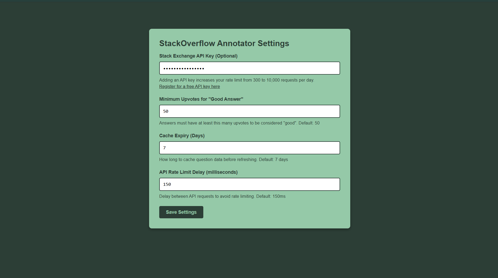

# StackOverflow Good Answer Annotator

A Chrome extension that annotates StackOverflow links in Google search results, showing you at a glance which questions have high-quality answers.

## Features

- 🔍 **Smart Annotations**: Automatically scans StackOverflow links in your Google search results
- ✅ **Good Answer Detection**: Highlights questions with answers that have 50+ upvotes
- ⚠️ **Vote Count Display**: Shows the top answer's score for quick assessment
- 🎨 **Subtle Design**: Uses muted colors that won't distract from your reading
- ⚡ **Fast & Lightweight**: Minimal performance impact with intelligent caching

## Screenshots

### Search Results Annotation
<!-- Add screenshot here -->

### Options Page
<!-- Add screenshot here -->

## How It Works

The extension adds visual badges next to StackOverflow links in Google search results:

- **✔ Good answer (X⬆)** - Green badge indicates the question has at least one answer with 50+ upvotes
- **⚠ Low votes (X⬆)** - Rose badge shows questions with answers but low vote counts
- **✗ No good answer** - Rose badge indicates no highly-voted answers found

## Installation

Since this is an unpacked extension, follow these steps to install it in Chrome:

1. **Download or clone this repository** to your local machine

2. **Open Chrome** and navigate to `chrome://extensions/`

3. **Enable Developer Mode** by toggling the switch in the top-right corner

4. **Click "Load unpacked"** button

5. **Select the extension folder** (the folder containing `manifest.json`)

6. The extension should now be installed and active!

## Usage

1. Simply perform a Google search that includes StackOverflow results
2. The extension will automatically annotate StackOverflow links with quality indicators
3. Use these badges to quickly identify which questions have helpful, well-received answers

## Configuration

Access the options page by right-clicking the extension icon and selecting "Options", or navigate to [`chrome://extensions/`](chrome://extensions) and click "Details" then "Extension options".

### Available Settings

- **Stack Exchange API Key** (Optional)
  - Adding an API key increases your rate limit from 300 to 10,000 requests per day
  - [Register for a free API key here](https://stackapps.com/apps/oauth/register)
  - The key is masked after saving for security

- **Minimum Upvotes for "Good Answer"** (Default: 50)
  - Customize the threshold for what counts as a high-quality answer
  - When changed, cached entries are automatically re-evaluated

- **Cache Expiry** (Default: 7 days)
  - How long to cache question data before refreshing from the API
  - Helps reduce API calls and improve performance

- **API Rate Limit Delay** (Default: 150ms)
  - Delay between API requests to avoid rate limiting
  - Lower values = faster processing but higher risk of hitting rate limits

All settings are synced across your Chrome browsers automatically.

## Technical Details

- **Manifest Version**: 3
- **Permissions**: Storage, StackExchange API access
- **API**: Uses the official StackExchange API (2.3) to fetch answer data
- **Caching**: Implements intelligent caching to minimize API calls and improve performance

## Development

The extension consists of two main files:

- `manifest.json` - Extension configuration and permissions
- `content.js` - Content script that processes search results and adds annotations

## Requirements

- Google Chrome (or Chromium-based browser)
- Active internet connection for API calls to StackExchange

## Privacy

This extension:
- Only runs on Google search result pages
- Makes API calls to StackExchange to fetch public question data
- Stores cached results locally to improve performance
- Does not collect or transmit any personal data

## License

MIT License - Feel free to modify and distribute as needed.

## Contributing

Contributions, issues, and feature requests are welcome!

---

Made with ❤️ for developers who want to find quality answers faster

